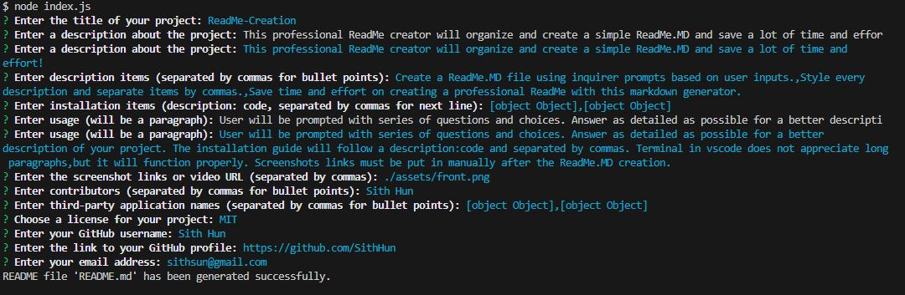

# Professional-ReadMe-Generator 
  

This professional ReadMe creator will organize and create a simple ReadMe.MD and save a lot of time and effort!

## Description
* Create a ReadMe.MD file using inquirer prompts based on user inputs.
* Style every description and separate items by commas.
* Save time and effort on creating a professional ReadMe with this markdown generator.

## Table of Contents
- [Installation](#installation)
- [Usage](#usage)

- [Screenshot/Video](#screenshotvideo)
- [Deployed APP](#deployed-application)
- [Contributing](#contributing)
- [License](#license)
- [Questions](#questions)

## Installation
* _Run in terminal_:
> npm install

* _Run in terminal_:
> node index.js

## Usage
User will be prompted with series of questions and choices. Answer as detailed as possible for a better description of your project. The installation guide will follow a description:code and separated by commas. Terminal in VS-Code does not appreciate long paragraphs, but it will function properly. Deployed links must inserted manually along side contributors github links.

## Screenshot/Video

## Contributing
*A list of contributors on this project includes:*

* [Sith Hun](https://github.com/SithHun)

*Third-party applications used to create this project:*
* [Inquirer](#inquirer)
* [NodeJS](#nodejs)

## License
*This project is licensed under the MIT.*

## Questions
If you have any questions, you can reach out to me via GitHub: [@Sith Hun](https://github.com/SithHun)

Feel free to contact me via email: sithsun@gmail.com

 

> *Credits: This ReadMe was created with ❤️ by [Professional-ReadMe-Generator](https://github.com/SithHun/Professional-ReadMe-Generator)*